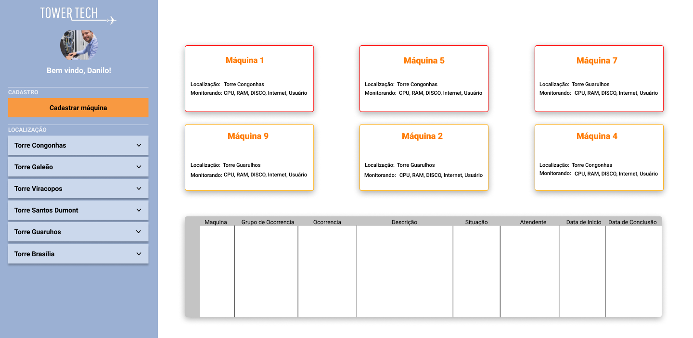
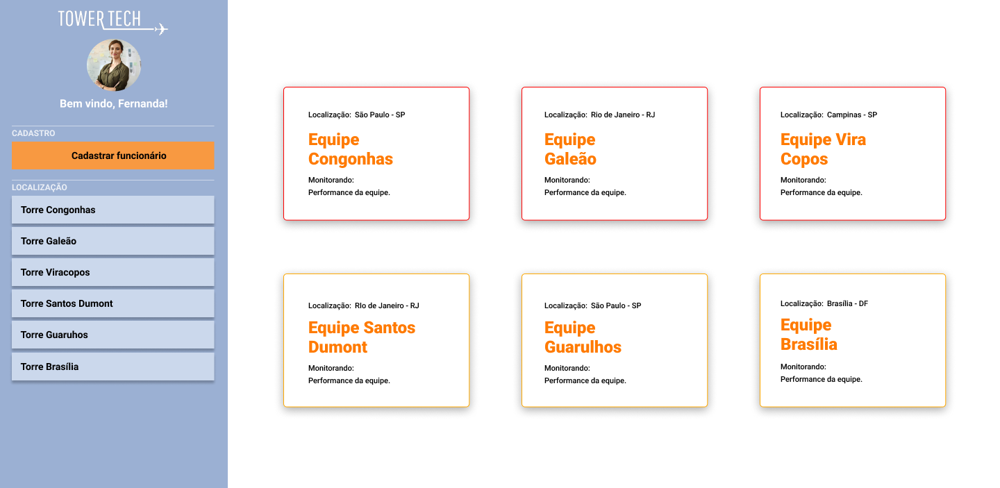
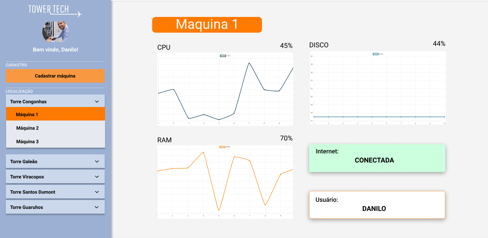
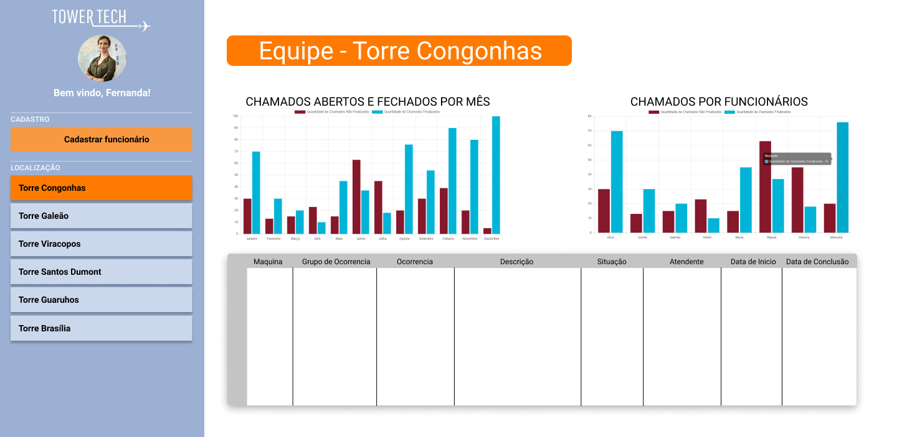
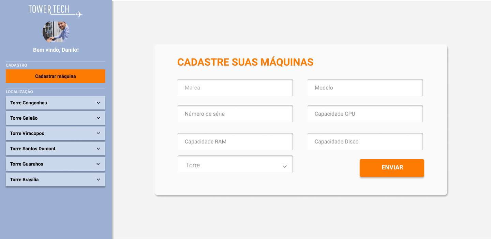
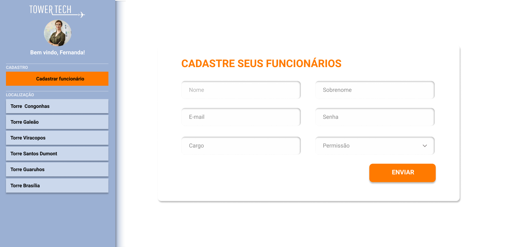
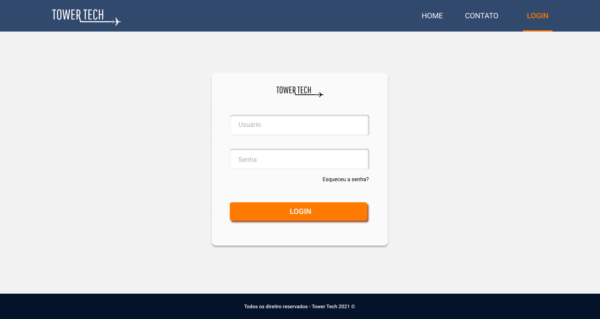
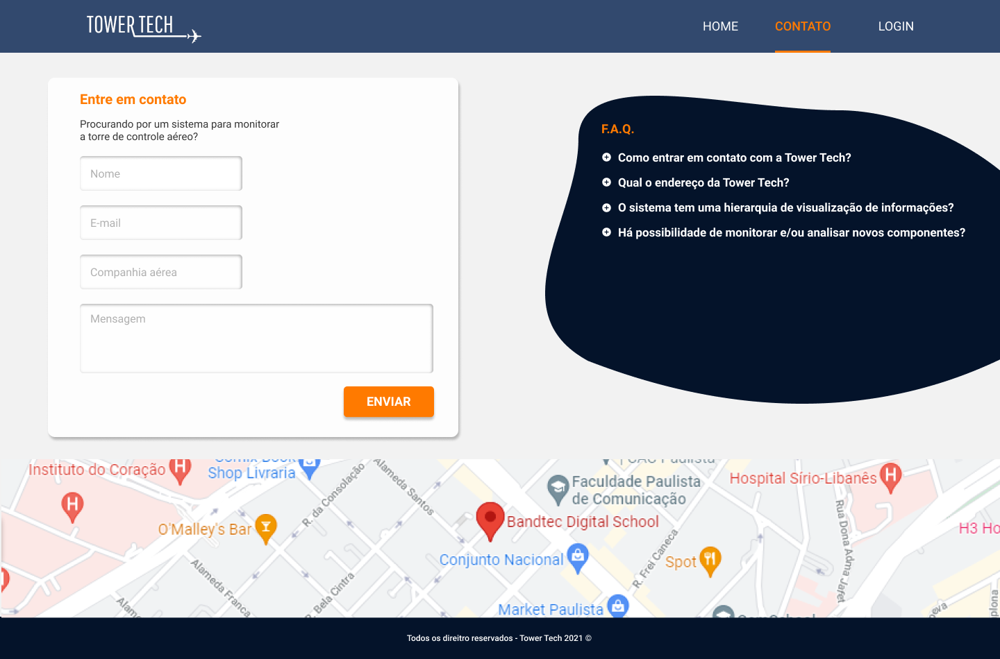
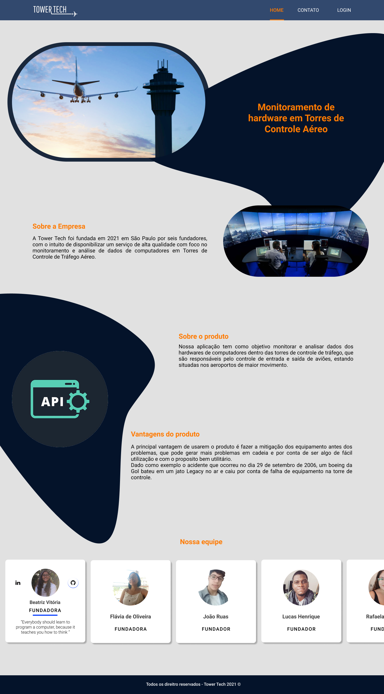

   
   

--- 

  

 <a href="#-sobre-o-projeto">Sobre</a> •
<a href="#-layout">Layout</a> • 
 <a href="#%EF%B8%8F-funcionalidades">Funcionalidades</a> •
 <a href="#-tecnologias">Tecnologias</a> 

## 💻 Sobre o projeto

✈️ Tower Tech - Uma empresa que disponibiliza um serviço de monitoramento e analise de dados com o objetivo de mitigar os possíveis erros e/ou problemas em  computadores localizados em Torres de Controle de Tráfego Aéreo. 

## 🎨 Layout

  
  
  
  
  
  
  
  
   
  

---

## ⚙️ Funcionalidades

- [ ] Unidade de Processamento Central (CPU)

  - [ ] Verificar grandes variações de processamento
  - [ ] Utilização por Processo
  - [ ] Velocidade
   - [ ] Verificar Temperatura

- [ ] Memoria RAM (Random Access Memory)

  - [ ] Verificar quantidade de memoria em uso
  - [ ] Verificar quantidade de memoria Disponível
  
- [ ] Disco Rígido (HD)
	 - [ ] Espaço Disponivel
	 
- [ ] Ocorrências

  - [ ] Gerar e enviar uma ocorrencia via e-email e Slack
  - [ ] Armazenar histórico de ocorrencias
  - [ ] Mostrar e escalonar a gravidade do problema

- [ ] Dashboard

  - [ ] Exibir Gráficos relevantes a variação de memoria RAM, CPU e HD de forma dinamica e em tempo real
  - [ ] Exibir Gráficos demonstrando as grandes variações de memoria RAM, CPU e HD que ocorreram durante os meses e anos
  - [ ] Exibir Gráficos demonstrando o desempelho da equipe de tecnicos por individuo na resolução de chamados
  - [ ] A cada mes o sistema gerara um Analytics baseado nos dados dos Hardwares Coletados e no SLA da empresa

---

## 🛠 Tecnologias

As seguintes ferramentas foram usadas na construção do projeto:

#### **Website:** 

- **[JavaScript](https://developer.mozilla.org/pt-BR/docs/Web/JavaScript/About_JavaScript)**
- **[HTML](https://www.w3schools.com/html/html_intro.asp)**
- **[CSS](https://www.w3schools.com/css/css_intro.asp)**

#### **Client e Analise de Dados:**

- **[Python](https://www.python.org/about/)**
- **[Java](https://www.java.com/pt-BR/about/)**
- **[R](https://www.r-project.org/about.html)**

---

## 🌈 Contribuidores 

<table>
  <tr>
          <td align="center">
      <a href="https://github.com/BeatrizVit">
         
        
          <b>Beatriz Vitoria</b>
        
      </a>
    </td>
    <td align="center">
      <a href="https://github.com/Flavia-OlSi">
         
        
          <b>Flavia de  Oliveira</b>
        
      </a>
    </td>
            <td align="center">
      <a href="https://github.com/jvruas">
         
        
          <b>João Ruas</b>
        
      </a>
       </td>
               <td align="center">
      <a href="https://github.com/lucashenrique01">
         
        
          <b>Lucas Henrique</b>
        
      </a>
    </td>
    <td align="center">
      <a href="https://github.com/RafaAmancioSoares">
         
        
          <b>Rafaela Amâncio</b>
        
      </a>
    </td>
    <td align="center">
      <a href="https://github.com/Rodrigo020502">
         
        
          <b>Rodrigo Garcez</b>
        
      </a>
    </td>
  </tr>
</table>

